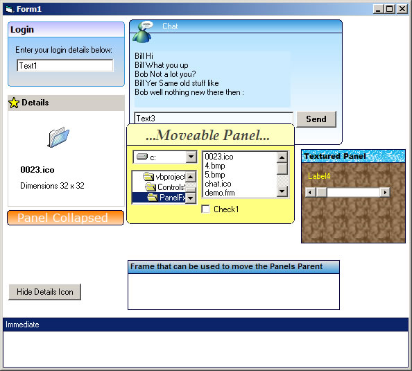



## Dm PanelFx

### Description

A Stylish Panel controls, supports, Soild Color, Texture, Graident, Round Cornners, Moveable, Moveable Partent, Titlebar Icon, And a host of other properties.
 
### More Info
 

             |
---                |---
**Submitted On**   |2001-03-04 22:16:12
**By**             |[dreamvb](https://github.com/Planet-Source-Code/PSCIndex/blob/master/ByAuthor/dreamvb.md)
**Level**          |Beginner
**User Rating**    |5.0 (90 globes from 18 users)
**Compatibility**  |VB 5\.0, VB 6\.0
**Category**       |[Custom Controls/ Forms/  Menus](https://github.com/Planet-Source-Code/PSCIndex/blob/master/ByCategory/custom-controls-forms-menus__1-4.md)
**World**          |[Visual Basic](https://github.com/Planet-Source-Code/PSCIndex/blob/master/ByWorld/visual-basic.md)
**Archive File**   |[Dm\_PanelFx1979873132006\.zip](https://github.com/Planet-Source-Code/dreamvb-dm-panelfx__1-64645/archive/master.zip)

